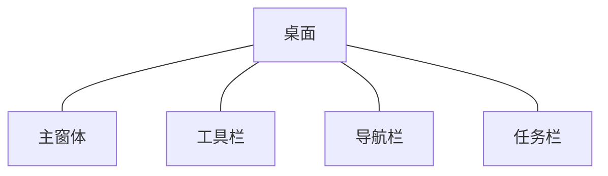

# deskTop

tinyPiXOS 提供的示例桌面程序。

---

## 介绍

桌面应用核心功能涵盖已安装应用管理、程序启动、交互控制及系统监控四大部分：

1. ​应用展示与管理​​：

- 主界面集中显示已安装应用列表，支持快捷启动
- 应用安装与卸载

2. ​运行态控制​​：

- 应用启动后自动激活​​顶部工具栏​​
- 通过​​导航条​​实现桌面快速返回
- 调用​​任务管理器​​查看实时进程

3. ​进程管理​​：

- 可视化监控所有运行中应用
- 支持强制终止进程或快速切换回已启动应用



## 安装流程

```bash
mkdir build
cd build
cmake ../
make 
make install
```

## 说明

1. 安装过程中即make install过程中，按照如下步骤执行文件安装拷贝
  - 首先会根据平台不同向 tinyPiXApp/install/install_x86_64 或 tinyPiXApp/install/install_arm64文件夹拷贝应用的安装文件，例如应用图标、运行文件、配置文件等等；用于对应用进行打包
  - 将所有安装文件（文件内容与第一条相同）安装至系统目录

## 注意

***请不要在应用目录内放置无关文件！！！***

安装过程会将应用旧目录移除，例如 tinyPiXApp/install/install_x86_64/app/desk0000-0000-0000-0000-0000000000000 以及系统安装目录的当前应用文件夹会被彻底删除。