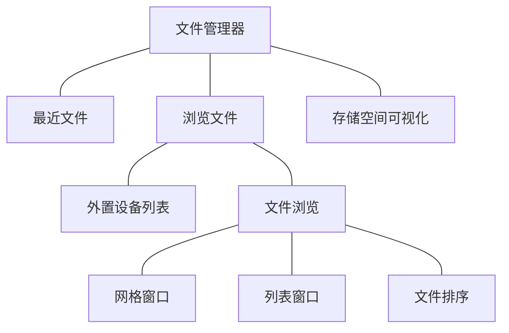

# fileManagement

tinyPiXOS 提供的示例文件管理器程序。

---

## 介绍

文件管理器功能架构​​

1. ​快捷访问系统​​

- 历史记录：最近打开文件智能追踪
- 分类通道：文档/音乐/视频等预设分类直达

2. ​文件浏览管理​​

- ​​视图模式​​：列表/网格双模式动态切换
- 基础属性：文件名/大小/类型/修改时间
- 智能排序：名称/大小/类型/日期多维度排序

3. 外部设备管理​​

- USB设备自动识别与挂载
- 点击直接访问设备文件系统

4. ​​存储空间可视化

- 容量监控：实时显示总空间/已用空间
- 类型分布：按文件类别统计存储占比



## 安装流程

```bash
mkdir build
cd build
cmake ../
make 
make install
```

## 说明

1. 安装过程中即make install过程中，按照如下步骤执行文件安装拷贝
  - 首先会根据平台不同向 tinyPiXApp/install/install_x86_64 或 tinyPiXApp/install/install_arm64文件夹拷贝应用的安装文件，例如应用图标、运行文件、配置文件等等；用于对应用进行打包
  - 将所有安装文件（文件内容与第一条相同）安装至系统目录
2. 6e3aaf4e-7a62-46d7-172d-e244038c4ae7.json 为应用运行配置json。可手动配置相关参数，或者由打包工具生成。
