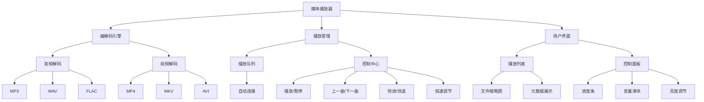

# mediaPlayer

tinyPiXOS 提供的示例媒体播放器程序。

---

## 介绍

媒体播放器核心功能：

1. ​多格式支持​​

- ​音频格式​​：MP3, WAV, FLAC 等主流格式解码
- ​视频格式​​：MP4, MKV, AVI 等常见封装格式解析

2. ​播放列表管理​​

- 可视化文件队列展示
- 自动连续播放队列文件

3. ​​播放控制体系​​

- 基础控制​​：播放/暂停/停止
- ​曲目导航​​：上一曲/下一曲跳转
- ​进度调节​​：精确快进/快退（支持点击与拖拽）
- ​高级设置​​：倍速播放（0.5x~3.0x可调）

4. ​实时参数调节​​

- 音量控制（0%~100%无级调节）
- 视频亮度动态调整



## 安装流程

```bash
mkdir build
cd build
cmake ../
make 
make install
```

## 说明

1. 安装过程中即make install过程中，按照如下步骤执行文件安装拷贝
  - 首先会根据平台不同向 tinyPiXApp/install/install_x86_64 或 tinyPiXApp/install/install_arm64文件夹拷贝应用的安装文件，例如应用图标、运行文件、配置文件等等；用于对应用进行打包
  - 将所有安装文件（文件内容与第一条相同）安装至系统目录
2. 1afd93b7-c938-f604-57be-edc95df6cb36.json 为应用运行配置json。可手动配置相关参数，或者由打包工具生成。
