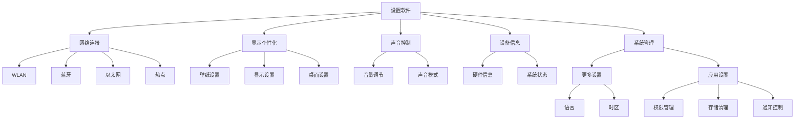

# systemSettings

tinyPiXOS 提供的示例系统设置程序。

---

## 介绍

设置软件提供系统级配置管理功能，主要分为五大核心模块：

1. ​网络连接管理​​

- WLAN：无线网络连接与配置
- 蓝牙：设备配对与传输控制
- 以太网：有线网络设置
- 热点：移动网络共享

2. ​​显示与个性化​​

- 壁纸设置：桌面背景管理
- 显示设置：亮度/色温/分辨率调节
- 桌面设置：图标布局与排列规则

3. ​​声音控制​​

- 媒体音量/铃声音量独立调节
- 均衡器与音效预设管理

4. ​设备信息中心​​

- 硬件配置信息（处理器/内存/存储）
- 系统版本与安全状态显示

5. ​​系统管理工具​​

- 更多设置：语言/时区/辅助功能等系统级选项
- 应用设置：应用权限/存储/通知管理等




## 安装流程

```bash
mkdir build
cd build
cmake ../
make 
make install
```

## 说明

1. 安装过程中即make install过程中，按照如下步骤执行文件安装拷贝
  - 首先会根据平台不同向 tinyPiXApp/install/install_x86_64 或 tinyPiXApp/install/install_arm64文件夹拷贝应用的安装文件，例如应用图标、运行文件、配置文件等等；用于对应用进行打包
  - 将所有安装文件（文件内容与第一条相同）安装至系统目录
2. 94301ca4-d753-9ae8-626a-206c15d6abdd.json 为应用运行配置json。可手动配置相关参数，或者由打包工具生成。
