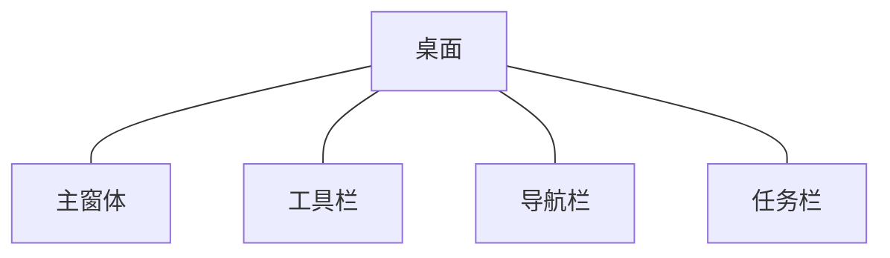
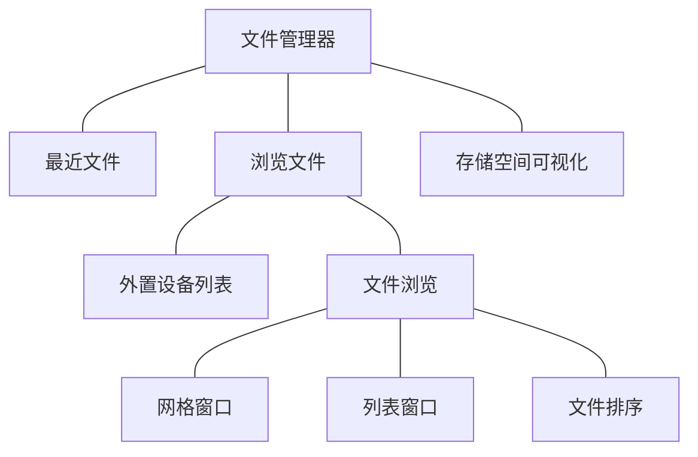
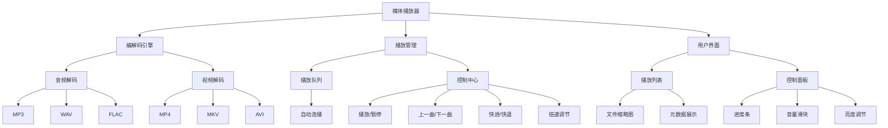
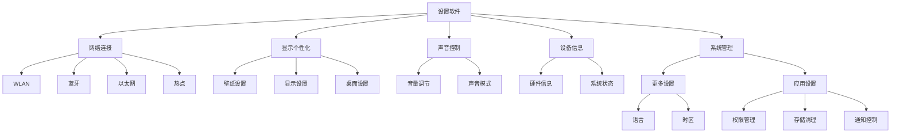

# tinyPiXApp 🚀

<div align="center">

    

[📖 TinyPiXOS官网](https://www.tinypixos.com/)

</div>

tinyPiXApp 为 TinyPiXOS 提供的所有示例程序，包括桌面、文件管理器、媒体播放器等应用以及部分组件使用示例应用。

- Application: 示例应用
- ComDemoApplication: 组件效果演示应用

---

# 一、项目简介 📚

**TinyPiXOS** 以开源Linux为基础，通过创新的内核级轻量化改造与精简设计，摒弃了X11/Wayland等传统图形方案，运用纯C/C++从底层重构出超轻量级的整体图形技术栈——包含高效窗口管理、精简GUI框架及深度优化的内核机制。

**核心目标：** 在最小化硬件资源配置的前提下，确保流畅的多应用并行处理能力，提供完备的桌面级核心功能体验（资源管理、外设驱动、图形渲染等）。

**TinyPiXOS**，以硬核技术实力追求极致性能与效率！

## Application

Application 目录下为所有示例应用，包括桌面、文件管理器、媒体播放器等应用​。

### 桌面（deskTop）

桌面应用核心功能涵盖已安装应用管理、程序启动、交互控制及系统监控四大部分：

1. ​应用展示与管理​​：

- 主界面集中显示已安装应用列表，支持快捷启动
- 应用安装与卸载

2. ​运行态控制​​：

- 应用启动后自动激活​​顶部工具栏​​
- 通过​​导航条​​实现桌面快速返回
- 调用​​任务管理器​​查看实时进程

3. ​进程管理​​：

- 可视化监控所有运行中应用
- 支持强制终止进程或快速切换回已启动应用



### 文件管理器（fileManagement）

文件管理器功能架构​​

1. ​快捷访问系统​​

- 历史记录：最近打开文件智能追踪
- 分类通道：文档/音乐/视频等预设分类直达

2. ​文件浏览管理​​

- ​​视图模式​​：列表/网格双模式动态切换
- 基础属性：文件名/大小/类型/修改时间
- 智能排序：名称/大小/类型/日期多维度排序

3. 外部设备管理​​

- USB设备自动识别与挂载
- 点击直接访问设备文件系统

4. ​​存储空间可视化

- 容量监控：实时显示总空间/已用空间
- 类型分布：按文件类别统计存储占比



### 媒体播放器（mediaPlayer）

媒体播放器核心功能：

1. ​多格式支持​​

- ​音频格式​​：MP3, WAV, FLAC 等主流格式解码
- ​视频格式​​：MP4, MKV, AVI 等常见封装格式解析

2. ​播放列表管理​​

- 可视化文件队列展示
- 自动连续播放队列文件

3. ​​播放控制体系​​

- 基础控制​​：播放/暂停/停止
- ​曲目导航​​：上一曲/下一曲跳转
- ​进度调节​​：精确快进/快退（支持点击与拖拽）
- ​高级设置​​：倍速播放（0.5x~3.0x可调）

4. ​实时参数调节​​

- 音量控制（0%~100%无级调节）
- 视频亮度动态调整



### 系统设置（systemSettings）

设置软件提供系统级配置管理功能，主要分为五大核心模块：

1. ​网络连接管理​​

- WLAN：无线网络连接与配置
- 蓝牙：设备配对与传输控制
- 以太网：有线网络设置
- 热点：移动网络共享

2. ​​显示与个性化​​

- 壁纸设置：桌面背景管理
- 显示设置：亮度/色温/分辨率调节
- 桌面设置：图标布局与排列规则

3. ​​声音控制​​

- 媒体音量/铃声音量独立调节
- 均衡器与音效预设管理

4. ​设备信息中心​​

- 硬件配置信息（处理器/内存/存储）
- 系统版本与安全状态显示

5. ​​系统管理工具​​

- 更多设置：语言/时区/辅助功能等系统级选项
- 应用设置：应用权限/存储/通知管理等



### 相册（photoAlbum）

未来扩展。暂未实现。

### 日历（calendar）

未来扩展。暂未实现。

---

## ComDemoApplication

ComDemoApplication 目录下为部分组件演示的示例应用，用于展示组件的显示效果。

### ​核心功能模块​​

# 二、系统优势 🌟

相较于目前成熟的国产桌面操作系统及其所依赖的现有GUI框架，我们在核心模块的稳定性和应用生态的完备性方面，​仍存在一定的追赶距离。

**TinyPiXOS** 的诞生标志着我们从零起步，完成了基础技术栈的完整构建与自主掌控。其核心定位在于**提供一个独立可控、架构轻量且高度定制化的嵌入式桌面操作系统开发平台**。

**自主可控：** 自主研发窗口管理器PiXWM与GUI框架，不依赖X11/Wayland。

**轻量灵活：** 模块化架构按需裁剪，内存与进程调度优化，资源极致利用，从微型嵌入式设备到高性能移动终端均可灵活部署。

**异构兼容：** 统一C/C++开发接口，ARM/x86/RISC-V多平台无缝迁移。

**开箱即用：** 预置UI组件库，方便用户快速上手开发应用。

**长期维护：** 技术团队长期维护，不用担心遇到问题导致项目无法推动。

**中文支持：** 目前技术文档仅有中文文档，系统内文字中文支持友好。

**免费商用：** 免费商用（需保留版权标识），企业可低成本构建定制化系统，支撑产品快速落地。

---

# 三、技术架构 💻

TinyPiXOS整体架构图


---

# 四、开源协议 📜

**TinyPiXOS** 采用 **Apache License 2.0** 开源协议。您可以自由使用、修改和分发代码，但需遵守协议条款。Apache License 是一种宽松的开源协议，允许您在商业项目中使用本项目代码，同时保留原作者的版权声明。

---

# 五、开源目标 🎯

**TinyPiXOS** 作为一款面向轻量化硬件平台的桌面操作系统，其架构设计复杂、功能模块众多。目前现有版本虽已实现基础能力，仍需要开发者社区的力量共同完善。我们选择将核心框架开源，旨在汇聚开发者智慧，共同打造国产嵌入式操作系统生态基座。

🛠️共建国产基座：以PiXSingleGUI等三大模块为基座，联合打造自主可控的嵌入式开发生态

🤝包容共创：现有版本难免存在不足，请以开发者视角包容反馈，共同优化

🚀创造无限可能：鼓励基于开源框架构建创新应用，优秀项目将获官方技术支持

🔄持续承诺：核心团队将长期维护系统桌面与应用生态，定期发布关键更新

---

# 六、如何参与 🤝

## 项目构建

### 系统环境

- ​**操作系统**: Ubuntu 22.04.4 LTS  
- ​**编译器**: gcc g++ 11.4.0  
- ​**构建工具**: >=CMake 3.5.0  
- ​**语言标准**: C++11  

理论上对操作系统无限制；目前只在 Ubuntu 22.04.4 LTS 进行了验证。编译器版本和构建工具必须相同或高于要求版本。

### 源码下载

拉取代码，可以使用Github地址直接下拉，或者使用Gitee同步仓库拉取

```bash
git clone https://github.com/TinyPiXOS/tinyPiXApp.git
# git clone https://gitee.com/tinypixos/tinyPiXApp.git
```

### 构建安装

- ​**安装 PiXWM 基础库**

```bash
# 需要先安装完成 PiXWM 相关依赖；参考官网 PiXWM 安装教程
```

- ​**安装 tinyPiXCore 基础库**

```bash
# 需要先安装完成 tinyPiXCore 相关依赖；参考官网 tinyPiXCore 安装教程
```

- ​**构建 tinyPiXApp**

```bash
mkdir build
cd build
cmake ../
make
make install
```

### 使用说明

- 所有应用的生成文件会安装至/System/app目录下，使用应用UUID作为应用目录
- 应用的Json配置文件会安装至/System/conf/app目录下

## 贡献代码

- **提交问题**：在开源仓库的 Issues 页面提交问题或改进建议。
- **贡献代码**：按照贡献指南提交 Pull Request，帮助完善项目。
- **参与讨论**：加入知识星球社区，与其他开发者交流经验。

## 反馈与建议

### 📝 提交前自查

> [!TIP]
✅ 已在 [tinyPiXCore Issues](https://github.com/TinyPiXOS/tinyPiXCore/issues)和[tinyPiXApp Issues](https://github.com/TinyPiXOS/tinyPiXApp/issues)搜索过同类问题。  
✅ 使用最新版本进行验证后，问题仍然存在。  
✅ 在[知识星球](https://t.zsxq.com/JzbkN)当中检索，但是未找到同类问题。  

### 问题反馈渠道

#### 开源仓库Issues

在开源仓库的 Issues 页面提交问题或改进建议。

#### 知识星球反馈

> [!TIP]
如果您对项目很感兴趣，还未加入知识星球，我们建议您加入[知识星球](https://t.zsxq.com/JzbkN)深度了解和学习TinyPiXOS开源项目，与星球众多伙伴共同交流进步。  

🎁加入[“TinyPiXOS开发者联盟”知识星球](https://t.zsxq.com/JzbkN)，==即赠送20个专业版授权额度==。  

`活动随时取消，请有需要的个人/企业抓住机会！`

- 通过星球查询历史问题回复和进行新问题反馈


#### 问卷表单反馈

<div align="center">


</div>

[提交问题反馈问卷](https://wj.qq.com/s2/22794485/2341/)

#### 邮箱反馈

TinyPiXOS开发者服务邮箱
📧 <dev@tinypixos.com>

## 关注我们


## 如何系统学习TinyPiXOS

- 我们围绕TinyPiXOS项目技术栈，搭建了“从零构建桌面操作系统”课程，包括“TinyPiXCore系统学习”. “TinyPiXApp应用开发实战”和“PiXWM高级用法实战”三大板块和若干个子专栏，**通过阶梯式能力进阶，赋能开发者​体系化掌握嵌入式OS全栈开发能力**。
- 为使开发者深度掌握TinyPiXOS技术栈的同时突破领域局限，我们特邀**嵌入式软件开发、硬件开发、人工智能、国产化**等跨领域专家驻场指导，助你构建多维度能力矩阵，实现**领域纵深+技能广度的双重提升**。


